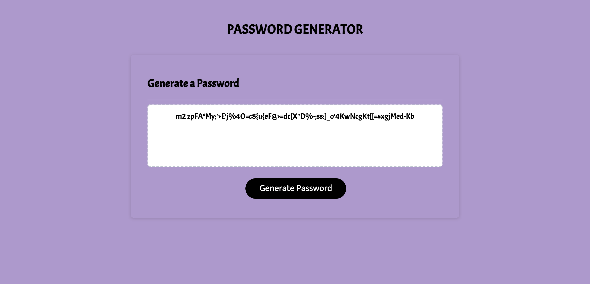

# Password Generator

This is a Password Generator. It creates a unique and secure password based on a user's inputs.

This project was built upon from existing code. The present HTML and CSS code is nearly-identical to the code originally provided. Colors and font-families have changed but sizing and positioning were untouched.

Some JavaScript was given at the start of the project. Over 50 lines of original code were added.

## Table of contents
* [Technologies](#technologies)
* [Mockup](#mockup)
* [Resources-used](#resources-used)
* [Possible-improvements](#possible-improvements)

## Technologies

This website was built and refactored using HTML, CSS, and JavaScript.

Users do not need setup.

## Mockup

The following image shows the website is action!

## Resources-used

* <a href="https://replit.com/repls/folder/Penn%20LPS" target="_blank_">Repl creations that helped me draft the final product.</a> 

* <a href="https://github.com/AmyShafer/decemberFolder" target="_blank_">A Practice Project that served as my training wheels.</a> 

* <a href="https://developer.mozilla.org/en-US/docs/Learn/JavaScript/Building_blocks/Events" target="_blank_">I read up on JavaScript Events.</a> 

* <a href="https://stackoverflow.com/questions/3943772/how-do-i-shuffle-the-characters-in-a-string-in-javascript" target="_blank_">This code helped me produce my own shuffler.</a> 

* <a href="https://w3schools.sinsixx.com/js/js_special_characters.asp.htm" target="_blank_">I required additional assistance when dealing with special characters.</a> 

## Future-improvements

This application can be improved by offering the user a checkbox input instead of prompt. JavaScript's prompt display has several drawbacks. From the user's point of view, they may not realize they entered a typo. Think of all the times you were sure your typed you password correctly! 

For learning purposes, prompt fit in well with this lesson. I look forward to personalizing this project with my own design ideas. I will have more examples to draw inspiration from as the class dives deeper into practical event options. 

